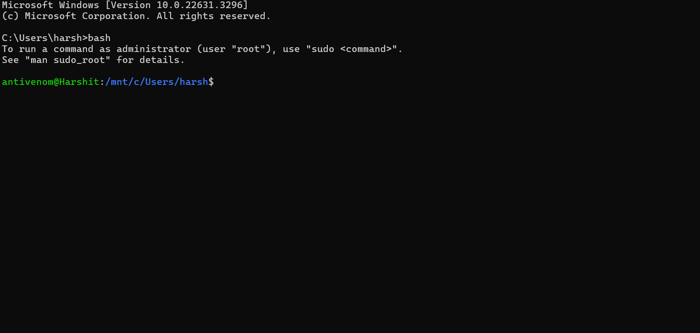

# Second task  Write-up

## The TASK
 given is a binary file run the file and solve the q if answer is correct display the flag and get the answer while also specifying the input value

    https://drive.google.com/drive/folders/1qQjmxKC9W_AdcbaZOUCjysS5E46JY7UL?usp=sharing

## Challenge Descriptions
The google drive link contained a binary file named q which couldn't be ran on any code text editors and from the description the goal was to find the flag (specific string) from the program somehow.

--- 

---

## Strategy to get the flag
### Running the file
1. The first idea was to run the code to know what exactly was the program.
2. After browsing online I found out that binary files can only be ran on linux terminal.
3. I thought I have install a virtual machine but after some research I found about Windows Subsystem for Linux(WSL).
4. I installed Ubuntu 22.04.3 LTS on my computer.

5. Running the file

### Analyzing the program 
1. Open the directory in which the file is using cd command

2. Try to print flag by typing 4 (worth a try)
3. Research about heaps and how to exploit a program using a heap.

### Understanding the Heap Structure
The heap memory consisted of:
- **input_data**: A 5-byte buffer allocated on the heap.
- **safe_var**: A variable located immediately after `input_data` on the heap. This variable was the target for exploitation, as its content determined whether the flag would be displayed.

### Exploitation Procedure

---

## Tools Utilized
- Decompilers like Ghidra or IDA Pro for binary analysis.
- A text editor for payload creation.
- Terminal for interacting with the binary.

---

## Key Takeaways
This challenge provided a practical demonstration of the dangers associated with heap overflow vulnerabilities. It emphasized the critical role of proper bounds checking in software development. Furthermore, it highlighted the effectiveness of manual memory analysis for understanding and exploiting controlled memory situations.

