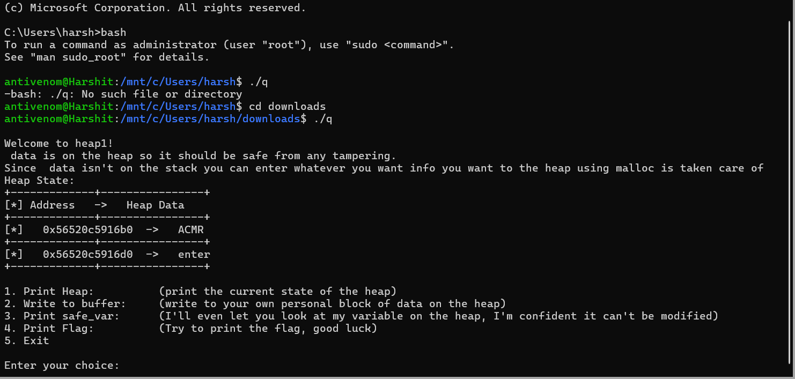

# Second task  Write-up

## The TASK
 given is a binary file run the file and solve the q if answer is correct display the flag and get the answer while also specifying the input value

    https://drive.google.com/drive/folders/1qQjmxKC9W_AdcbaZOUCjysS5E46JY7UL?usp=sharing

## Challenge Descriptions
The google drive link contained a binary file named q which couldn't be ran on any code text editors and from the description the goal was to find the flag (specific string) from the program somehow.

--- 

---

## Strategy to get the flag
### Running the file
1. The first idea was to run the code to know what exactly was the program.
2. After browsing online I found out that binary files can only be ran on linux terminal.
3. I thought I have install a virtual machine but after some research I found about Windows Subsystem for Linux(WSL).
4. I installed Ubuntu 22.04.3 LTS on my computer.

5. Running the file

### Analyzing the program 
1. Open the directory in which the file is using cd command

2. Try to print flag by typing 4 (worth a try)
3. Research about heaps and how to exploit a program using a heap.

### Understanding the Heap Structure
The first thing that came up when I searched for things to exploit in a program containing heaps was heap overflowing.

I did my research about and here's what I learned from it -
            Heap overflowing, also known as buffer overflow, occurs when a program attempts to write more data into a heap-allocated memory buffer than it can hold, resulting in data overflowing into adjacent memory regions. This can lead to application crashes, unintended behavior, or, in a malicious context, execution of arbitrary code.
            Consequences:
                    . Unintended behavior: Applications can malfunction, crash, or produce incorrect outputs.
                    . Code execution: Attackers may exploit heap overflow to execute arbitrary code, potentially compromising the system.
The heap memory consisted of:
- **input_data**: A 5-byte buffer allocated on the heap.
- **safe_var**: A variable located immediately after `input_data` on the heap. This variable was the target for exploitation, as its content determined whether the flag would be displayed.

### Printing the flag 
1. When I ran the program and entered 2 to write my custom block of data in the heap and then print the heap I noticed that the text I  wrote got replaced by the ACMR string.
2. Then I tried again to print the flag but still couldn't print it.
3. After that I gave a long random string as an input and when I printed the state of heap and it printed the string in the first row and part of the string in the second row 
4. After counting the characters I noticed a difference of 32 bits in the main string and sub-string .
5. To overload the heap I knew I had to give a string with 32 characters and then ACMR in it to get ACMR in the bottom row and change the value of safe_var to ACMR
6. So,I gave **abcdefghijklmnopqrstuvwxyz123456ACMR** as input and I got ACMR in the primary address.
7. Then I simply tried to print the flag and it worked and I got the flag as **acm_ftw**.

---
## Key Takeaways
This challenge provided a practical demonstration of the dangers associated with heap overflow vulnerabilities. It emphasized the critical role of proper bounds checking in software development. Furthermore, it highlighted the effectiveness of manual memory analysis for understanding and exploiting controlled memory situations.

